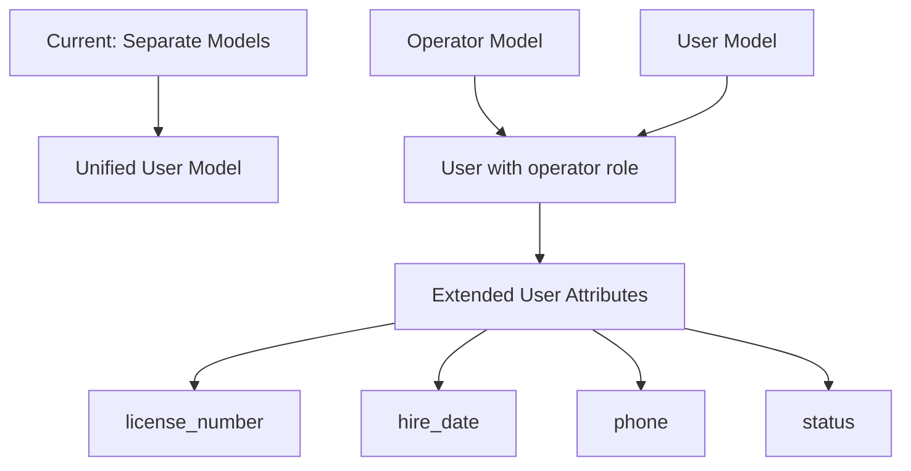
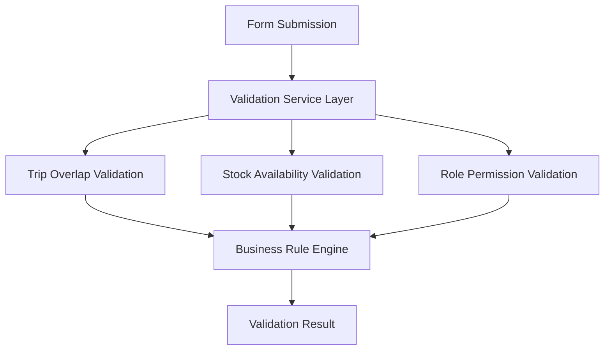

# Design Document

## Overview

This design addresses critical architectural flaws and UX issues in the truck fleet management system. The solution focuses on consolidating the operator/user data model, implementing form wizards for complex interfaces, adding comprehensive validation services, improving user experience through better field visibility and contextual help, implementing automatic inventory updates, and enforcing proper approval permissions.

## Architecture

### Data Model Consolidation

**Problem**: The system currently has both `Operator` and `User` models, creating data duplication and inconsistency.

**Solution**: Migrate to a unified User-based system where operators are users with specific roles and extended attributes.



### Form Wizard Architecture

**Problem**: Complex forms like MaintenanceRecord overwhelm users with too many fields at once.

**Solution**: Implement multi-step wizards that break complex forms into logical, manageable steps.


### Validation Service Layer

**Problem**: Business rule validation is scattered and inconsistent across the application.

**Solution**: Centralized validation services that handle complex business rules and provide consistent error messaging.



## Components and Interfaces

### 1. User Model Extension

**Enhanced User Model** with operator-specific fields:

```php
// Migration: Add operator fields to users table
Schema::table('users', function (Blueprint $table) {
    $table->string('license_number')->nullable();
    $table->string('phone')->nullable();
    $table->date('hire_date')->nullable();
    $table->enum('status', ['active', 'inactive'])->default('active');
});
```

**User Model Methods**:
- `isOperator()`: Check if user has operator role
- `getOperatorProfile()`: Get operator-specific data
- `canDriveVehicle()`: Check driving permissions
- `getActiveTrips()`: Get current trip assignments

### 2. Migration Service

**OperatorMigrationService** to handle data consolidation:

```php
class OperatorMigrationService
{
    public function migrateOperatorsToUsers(): void
    {
        // 1. Create users for operators without user accounts
        // 2. Update existing relationships to point to users
        // 3. Preserve all operator-specific data
        // 4. Validate data integrity
    }
}
```

### 3. Form Wizard Components

**MaintenanceWizard** with four logical steps:

1. **Vehicle Identification**
   - Vehicle type selection (Truck/Trailer)
   - Vehicle selection with search
   - Maintenance type classification
   - Date selection

2. **Work Description**
   - Detailed description with markdown editor
   - Mechanic assignment
   - Work category selection

3. **Parts and Inventory**
   - Real-time stock checking
   - Part selection with search
   - Quantity validation
   - Cost calculation
   - Stock reservation

4. **Evidence and Documentation**
   - File upload for photos/receipts
   - Additional notes
   - Final review and confirmation

### 4. Validation Services

**TripValidationService**:
```php
class TripValidationService
{
    public function validateVehicleAvailability(int $vehicleId, Carbon $startDate, Carbon $endDate): ValidationResult
    public function validateOperatorAvailability(int $operatorId, Carbon $startDate, Carbon $endDate): ValidationResult
    public function validateRouteConstraints(array $routeData): ValidationResult
}
```

**StockValidationService**:
```php
class StockValidationService
{
    public function validatePartAvailability(int $partId, float $quantity): ValidationResult
    public function reserveParts(array $parts): ReservationResult
    public function releaseParts(array $parts): void
}
```

### 5. Enhanced Field Resolver

**Improved FormFieldResolver** with contextual help:

```php
class EnhancedFormFieldResolver implements FormFieldResolverInterface
{
    public function getFieldWithHelp(User $user, string $model, string $field): array
    {
        return [
            'visible' => $this->isFieldVisible($user, $model, $field),
            'editable' => $this->isFieldEditable($user, $model, $field),
            'helpText' => $this->getFieldHelpText($user, $model, $field),
            'restrictionReason' => $this->getRestrictionReason($user, $model, $field)
        ];
    }
}
```

### 6. Product Request Observer

**Automatic Inventory Management** through model observers:

```php
class ProductRequestObserver
{
    public function updated(ProductRequest $productRequest): void
    {
        // When status changes to 'received', update inventory
        if ($productRequest->isDirty('status') && $productRequest->status === 'received') {
            $this->increaseInventory($productRequest);
        }
        
        // When status changes from 'received' to something else, reverse the update
        if ($productRequest->isDirty('status') && $productRequest->getOriginal('status') === 'received') {
            $this->decreaseInventory($productRequest);
        }
    }
    
    private function increaseInventory(ProductRequest $productRequest): void
    {
        // Update spare part stock
        // Create audit trail entry
        // Prevent duplicate updates
    }
}
```

### 7. Permission Service Enhancement

**Role-Based Approval Control**:

```php
class ProductRequestPermissionService
{
    public function canApprove(User $user, ProductRequest $productRequest): bool
    {
        // Only admins and accountants can approve
        return $user->hasAnyRole(['super_admin', 'administrador', 'contador']) 
            && $productRequest->status === 'pending';
    }
    
    public function canMarkAsReceived(User $user, ProductRequest $productRequest): bool
    {
        // Only admins and accountants can mark as received
        return $user->hasAnyRole(['super_admin', 'administrador', 'contador'])
            && $productRequest->status === 'ordered';
    }
}

## Data Models

### Extended User Model

```php
class User extends Authenticatable
{
    protected $fillable = [
        'name', 'email', 'password', 'role',
        'license_number', 'phone', 'hire_date', 'status'
    ];

    // Operator-specific relationships
    public function trips(): HasMany
    {
        return $this->hasMany(Trip::class, 'operator_id');
    }

    public function weeklyPayrolls(): HasMany
    {
        return $this->hasMany(WeeklyPayroll::class, 'operator_id');
    }

    // Operator-specific methods
    public function getOperatorDisplayName(): string
    {
        return $this->isOperator() 
            ? "{$this->name} ({$this->license_number})"
            : $this->name;
    }
}
```

### Validation Result Models

```php
class ValidationResult
{
    public function __construct(
        public bool $isValid,
        public array $errors = [],
        public array $warnings = [],
        public array $suggestions = []
    ) {}
}

class ReservationResult
{
    public function __construct(
        public bool $success,
        public array $reservedItems = [],
        public array $failedItems = [],
        public string $reservationId = ''
    ) {}
}
```

### Inventory Audit Trail Model

```php
class InventoryAudit extends Model
{
    protected $fillable = [
        'spare_part_id',
        'change_type',      // 'product_request_received', 'maintenance_usage', 'manual_adjustment'
        'quantity_change',  // Positive or negative
        'previous_stock',
        'new_stock',
        'reference_type',   // ProductRequest, MaintenanceRecord, etc.
        'reference_id',
        'user_id',
        'notes'
    ];
    
    public function sparePart(): BelongsTo
    {
        return $this->belongsTo(SparePart::class);
    }
    
    public function user(): BelongsTo
    {
        return $this->belongsTo(User::class);
    }
}

## Error Handling

### Validation Error Patterns

1. **Stock Shortage Errors**:
   - Clear indication of available vs requested quantity
   - Suggestions for alternative parts or reduced quantities
   - Option to create purchase requests

2. **Scheduling Conflict Errors**:
   - Visual timeline showing conflicts
   - Alternative vehicle/operator suggestions
   - Option to modify dates

3. **Permission Errors**:
   - Clear explanation of required role level
   - Contact information for access requests
   - Alternative actions available to current role

### User-Friendly Error Messages

```php
class ErrorMessageService
{
    public function getStockShortageMessage(string $partName, int $available, int $requested): string
    {
        return "❌ Stock insuficiente para {$partName}. " .
               "Disponible: {$available}, Solicitado: {$requested}. " .
               "💡 Sugerencia: Reducir cantidad o solicitar reabastecimiento.";
    }

    public function getSchedulingConflictMessage(string $vehicleName, Carbon $conflictDate): string
    {
        return "⚠️ {$vehicleName} ya tiene un viaje programado el {$conflictDate->format('d/m/Y')}. " .
               "💡 Sugerencia: Seleccionar otro vehículo o modificar las fechas.";
    }
}
```

## Testing Strategy

### Unit Tests

1. **User Model Tests**:
   - Operator role detection
   - Relationship integrity
   - Permission methods

2. **Validation Service Tests**:
   - Stock validation scenarios
   - Trip overlap detection
   - Edge cases and boundary conditions

3. **Migration Service Tests**:
   - Data integrity preservation
   - Relationship mapping
   - Rollback scenarios

### Integration Tests

1. **Wizard Flow Tests**:
   - Step-by-step progression
   - Data persistence between steps
   - Validation at each step

2. **Form Field Resolver Tests**:
   - Role-based field visibility
   - Help text generation
   - Permission checking

### Feature Tests

1. **Complete Maintenance Record Creation**:
   - End-to-end wizard flow
   - Stock reservation and release
   - File upload handling

2. **Trip Scheduling Validation**:
   - Conflict detection
   - Alternative suggestions
   - Multi-user scenarios

## Implementation Phases

### Phase 1: Data Model Consolidation
- Extend User model with operator fields
- Create migration service
- Update all relationships
- Preserve data integrity

### Phase 2: Validation Services
- Implement centralized validation layer
- Add business rule engines
- Create user-friendly error messages
- Add real-time validation

### Phase 3: Form Wizards
- Convert MaintenanceRecord to wizard
- Implement step-by-step validation
- Add progress indicators
- Enhance user experience

### Phase 4: Enhanced Field Resolution
- Improve FormFieldResolver with contextual help
- Add restriction explanations
- Implement role-based messaging
- Add accessibility improvements

### Phase 5: Inventory Management Automation
- Create ProductRequestObserver for automatic stock updates
- Implement InventoryAudit model for tracking changes
- Add duplicate update prevention
- Implement stock reversal for status changes

### Phase 6: Permission Enforcement
- Update ProductRequestPermissionService with role restrictions
- Restrict approval actions to admins and accountants
- Update UI to hide unauthorized actions
- Add authorization error messages

## Security Considerations

1. **Data Migration Security**:
   - Backup existing data before migration
   - Validate all data transformations
   - Implement rollback mechanisms

2. **Permission Validation**:
   - Server-side validation for all operations
   - Role-based access control
   - Audit logging for sensitive operations

3. **File Upload Security**:
   - Validate file types and sizes
   - Scan for malicious content
   - Secure storage with proper access controls