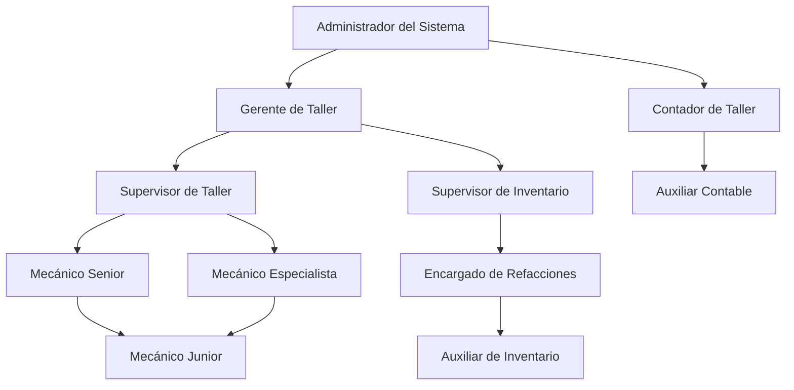
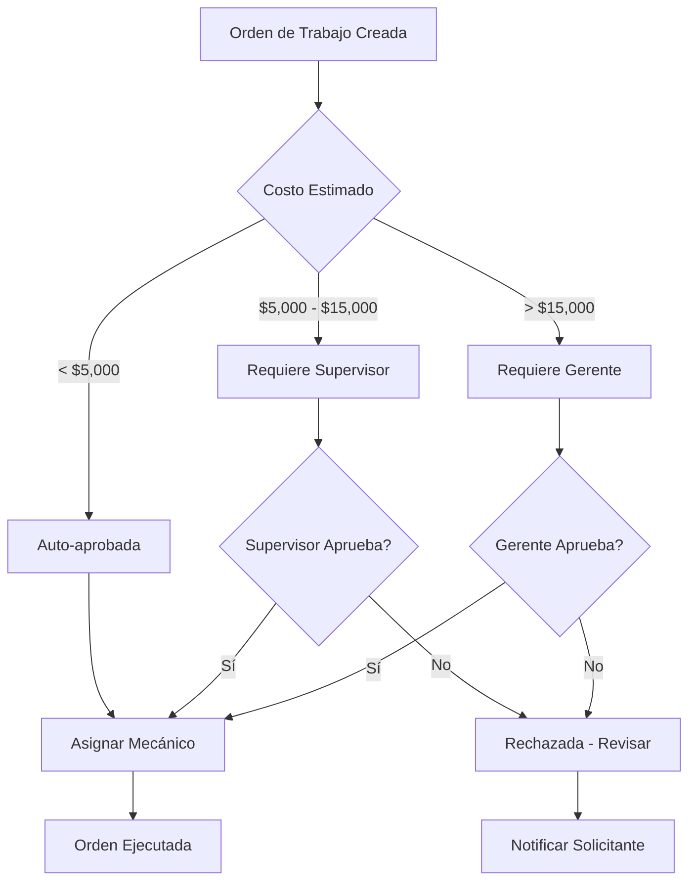
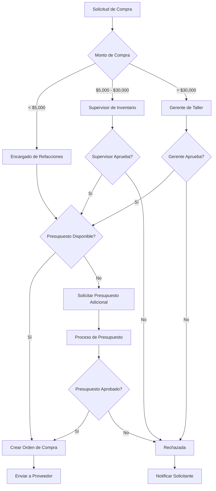

# Estructura de Permisos - Personal de Taller

## Resumen de Roles y Permisos

Este documento define la estructura completa de roles, permisos y controles de acceso para el personal del taller dentro del Sistema de Administración de Tractocamiones. La estructura está diseñada para proporcionar acceso granular basado en responsabilidades específicas y mantener la seguridad operativa.

## Jerarquía de Roles del Taller

### Estructura Organizacional



## Definición de Roles

### 1. Gerente de Taller
**Descripción**: Responsable general de todas las operaciones del taller, planificación estratégica y supervisión completa.

**Responsabilidades**:
- Supervisión general de todas las operaciones del taller
- Aprobación de órdenes de trabajo de alto costo
- Gestión de presupuestos y recursos
- Planificación estratégica del taller
- Supervisión del personal y evaluaciones de desempeño
- Aprobación de compras mayores
- Generación de reportes ejecutivos

**Acceso a Paneles**:
- Panel Principal de Administración (acceso completo)
- Panel de Contabilidad (acceso completo)
- Panel de Taller (acceso completo)

### 2. Supervisor de Taller
**Descripción**: Supervisión directa de las operaciones diarias del taller y coordinación del personal técnico.

**Responsabilidades**:
- Supervisión diaria de operaciones del taller
- Asignación de órdenes de trabajo a mecánicos
- Aprobación de órdenes de trabajo estándar
- Supervisión de calidad de reparaciones
- Coordinación de programación de mantenimientos
- Gestión de emergencias operativas
- Reportes operativos diarios

**Acceso a Paneles**:
- Panel Principal de Administración (acceso limitado)
- Panel de Taller (acceso completo excepto configuración)

### 3. Supervisor de Inventario
**Descripción**: Gestión completa del inventario de refacciones, compras y control de stock.

**Responsabilidades**:
- Gestión completa del inventario de refacciones
- Aprobación de órdenes de compra
- Control de niveles de stock y alertas
- Gestión de proveedores de refacciones
- Supervisión de movimientos de inventario
- Auditorías de inventario
- Reportes de inventario y costos

**Acceso a Paneles**:
- Panel Principal de Administración (módulos de inventario)
- Panel de Contabilidad (módulos relacionados con inventario)
- Panel de Taller (módulos de inventario)

### 4. Mecánico Senior
**Descripción**: Técnico experimentado con capacidad para realizar reparaciones complejas y supervisar mecánicos junior.

**Responsabilidades**:
- Ejecución de reparaciones complejas y especializadas
- Supervisión y entrenamiento de mecánicos junior
- Diagnóstico avanzado de problemas
- Liderazgo en reparaciones de emergencia
- Validación de trabajos de mecánicos junior
- Reportes técnicos detallados

**Acceso a Paneles**:
- Panel de Taller (acceso operativo completo)
- Panel Principal (consulta de información de vehículos)

### 5. Mecánico Especialista
**Descripción**: Técnico con especialización en sistemas específicos (motor, transmisión, eléctrico, etc.).

**Responsabilidades**:
- Reparaciones especializadas en su área de expertise
- Diagnóstico avanzado de sistemas específicos
- Soporte técnico a otros mecánicos
- Mantenimiento de herramientas especializadas
- Capacitación en nuevas tecnologías
- Documentación de procedimientos especializados

**Acceso a Paneles**:
- Panel de Taller (acceso operativo en su especialidad)
- Panel Principal (consulta limitada)

### 6. Mecánico Junior
**Descripción**: Técnico en entrenamiento que realiza reparaciones básicas bajo supervisión.

**Responsabilidades**:
- Ejecución de reparaciones básicas y mantenimientos rutinarios
- Asistencia a mecánicos senior en reparaciones complejas
- Mantenimiento básico de herramientas
- Registro de tiempo y materiales utilizados
- Aprendizaje continuo y capacitación

**Acceso a Paneles**:
- Panel de Taller (acceso básico y limitado)

### 7. Encargado de Refacciones
**Descripción**: Responsable directo del manejo físico del inventario y distribución de refacciones.

**Responsabilidades**:
- Recepción y almacenamiento de refacciones
- Distribución de materiales para órdenes de trabajo
- Control físico de inventario
- Registro de movimientos de stock
- Mantenimiento de orden en almacén
- Reportes de discrepancias de inventario

**Acceso a Paneles**:
- Panel de Taller (módulos de inventario)

### 8. Auxiliar de Inventario
**Descripción**: Soporte en actividades básicas de inventario y almacén.

**Responsabilidades**:
- Asistencia en recepción de materiales
- Organización física del almacén
- Conteos físicos de inventario
- Limpieza y mantenimiento del área de almacén
- Soporte en distribución de refacciones

**Acceso a Paneles**:
- Panel de Taller (acceso muy limitado, solo consultas básicas)

### 9. Contador de Taller
**Descripción**: Responsable de la gestión financiera específica del taller.

**Responsabilidades**:
- Análisis de costos de mantenimiento
- Generación de reportes financieros del taller
- Control de presupuestos por centro de costo
- Análisis de rentabilidad por tipo de servicio
- Auditoría de gastos del taller
- Facturación de servicios internos

**Acceso a Paneles**:
- Panel de Contabilidad (acceso completo)
- Panel de Taller (reportes y costos)

### 10. Auxiliar Contable
**Descripción**: Soporte en actividades contables y administrativas del taller.

**Responsabilidades**:
- Registro de facturas y gastos del taller
- Soporte en generación de reportes
- Archivo de documentación contable
- Asistencia en auditorías
- Captura de datos financieros

**Acceso a Paneles**:
- Panel de Contabilidad (acceso limitado)

## Matriz de Permisos Detallada

### Permisos por Módulo

#### Módulo de Órdenes de Trabajo

| Permiso | Gerente | Supervisor | Mec. Senior | Mec. Especialista | Mec. Junior | Contador |
|---------|---------|------------|-------------|-------------------|-------------|----------|
| `workshop.view_all_orders` | ✅ | ✅ | ✅ | ✅ | ❌ | ✅ |
| `workshop.view_own_orders` | ✅ | ✅ | ✅ | ✅ | ✅ | ❌ |
| `workshop.create_orders` | ✅ | ✅ | ✅ | ✅ | ❌ | ❌ |
| `workshop.edit_orders` | ✅ | ✅ | ✅ | ✅ | ❌ | ❌ |
| `workshop.delete_orders` | ✅ | ✅ | ❌ | ❌ | ❌ | ❌ |
| `workshop.assign_mechanics` | ✅ | ✅ | ✅ | ❌ | ❌ | ❌ |
| `workshop.approve_orders` | ✅ | ✅ | ❌ | ❌ | ❌ | ❌ |
| `workshop.close_orders` | ✅ | ✅ | ✅ | ✅ | ❌ | ❌ |
| `workshop.emergency_orders` | ✅ | ✅ | ✅ | ✅ | ❌ | ❌ |

#### Módulo de Inventario

| Permiso | Gerente | Sup. Inventario | Encargado Ref. | Aux. Inventario | Contador |
|---------|---------|-----------------|----------------|-----------------|----------|
| `inventory.view_all_parts` | ✅ | ✅ | ✅ | ✅ | ✅ |
| `inventory.create_parts` | ✅ | ✅ | ✅ | ❌ | ❌ |
| `inventory.edit_parts` | ✅ | ✅ | ✅ | ❌ | ❌ |
| `inventory.delete_parts` | ✅ | ✅ | ❌ | ❌ | ❌ |
| `inventory.adjust_stock` | ✅ | ✅ | ✅ | ❌ | ❌ |
| `inventory.create_purchase_orders` | ✅ | ✅ | ❌ | ❌ | ❌ |
| `inventory.approve_purchase_orders` | ✅ | ✅ | ❌ | ❌ | ✅ |
| `inventory.receive_parts` | ✅ | ✅ | ✅ | ✅ | ❌ |
| `inventory.transfer_parts` | ✅ | ✅ | ✅ | ❌ | ❌ |
| `inventory.view_costs` | ✅ | ✅ | ❌ | ❌ | ✅ |

#### Módulo de Personal y Tiempo

| Permiso | Gerente | Supervisor | Mec. Senior | Mec. Especialista | Mec. Junior |
|---------|---------|------------|-------------|-------------------|-------------|
| `time.view_all_records` | ✅ | ✅ | ❌ | ❌ | ❌ |
| `time.view_own_records` | ✅ | ✅ | ✅ | ✅ | ✅ |
| `time.start_session` | ✅ | ✅ | ✅ | ✅ | ✅ |
| `time.end_session` | ✅ | ✅ | ✅ | ✅ | ✅ |
| `time.edit_records` | ✅ | ✅ | ✅ | ❌ | ❌ |
| `time.approve_records` | ✅ | ✅ | ❌ | ❌ | ❌ |
| `time.view_rates` | ✅ | ✅ | ❌ | ❌ | ❌ |
| `time.manage_shifts` | ✅ | ✅ | ❌ | ❌ | ❌ |

#### Módulo de Reportes

| Permiso | Gerente | Supervisor | Sup. Inventario | Contador | Mec. Senior |
|---------|---------|------------|-----------------|----------|-------------|
| `reports.workshop_performance` | ✅ | ✅ | ❌ | ✅ | ❌ |
| `reports.inventory_status` | ✅ | ✅ | ✅ | ✅ | ❌ |
| `reports.cost_analysis` | ✅ | ❌ | ✅ | ✅ | ❌ |
| `reports.mechanic_performance` | ✅ | ✅ | ❌ | ❌ | ❌ |
| `reports.maintenance_history` | ✅ | ✅ | ❌ | ✅ | ✅ |
| `reports.export_data` | ✅ | ✅ | ✅ | ✅ | ❌ |

## Configuración de Seguridad por Rol

### Restricciones de Acceso por Horario

```php
// Configuración de horarios de acceso
'workshop_access_hours' => [
    'gerente_taller' => '24/7', // Acceso completo
    'supervisor_taller' => '05:00-22:00', // Horario extendido
    'mecanico_senior' => '06:00-20:00', // Horario de taller
    'mecanico_junior' => '07:00-19:00', // Horario supervisado
    'encargado_refacciones' => '06:00-18:00', // Horario de almacén
    'contador_taller' => '08:00-17:00', // Horario administrativo
],
```

### Restricciones por Ubicación IP

```php
// Configuración de acceso por ubicación
'workshop_ip_restrictions' => [
    'taller_principal' => ['192.168.1.0/24'],
    'oficina_administrativa' => ['192.168.2.0/24'],
    'almacen_refacciones' => ['192.168.3.0/24'],
    'acceso_remoto' => ['vpn.empresa.com'], // Solo para gerentes
],
```

### Niveles de Autorización Financiera

```php
// Límites de autorización por rol
'authorization_limits' => [
    'gerente_taller' => [
        'orden_trabajo' => 50000, // Sin límite práctico
        'compra_refacciones' => 100000,
        'ajuste_inventario' => 25000,
    ],
    'supervisor_taller' => [
        'orden_trabajo' => 15000,
        'compra_refacciones' => 0, // No puede aprobar compras
        'ajuste_inventario' => 0,
    ],
    'supervisor_inventario' => [
        'orden_trabajo' => 0,
        'compra_refacciones' => 30000,
        'ajuste_inventario' => 10000,
    ],
    'mecanico_senior' => [
        'orden_trabajo' => 5000, // Solo para órdenes menores
        'compra_refacciones' => 0,
        'ajuste_inventario' => 0,
    ],
],
```

## Flujos de Aprobación

### Aprobación de Órdenes de Trabajo



### Aprobación de Compras



## Auditoría y Trazabilidad

### Eventos Auditables por Rol

```php
// Configuración de auditoría por rol
'audit_events' => [
    'gerente_taller' => [
        'all_actions', // Auditar todas las acciones
        'login_logout',
        'permission_changes',
        'high_value_approvals',
    ],
    'supervisor_taller' => [
        'order_assignments',
        'order_approvals',
        'status_changes',
        'login_logout',
    ],
    'mecanico_senior' => [
        'order_completions',
        'time_tracking',
        'parts_usage',
        'login_logout',
    ],
    'encargado_refacciones' => [
        'inventory_movements',
        'stock_adjustments',
        'parts_distribution',
        'login_logout',
    ],
],
```

### Retención de Logs por Tipo de Usuario

```php
// Períodos de retención de logs
'log_retention' => [
    'gerente_taller' => '7_years', // Retención extendida
    'supervisor_taller' => '3_years',
    'contador_taller' => '7_years', // Requerimientos fiscales
    'mecanico_senior' => '2_years',
    'mecanico_junior' => '1_year',
    'encargado_refacciones' => '3_years',
],
```

## Configuración de Notificaciones

### Alertas por Rol

```php
// Configuración de notificaciones
'notifications' => [
    'gerente_taller' => [
        'high_cost_orders' => true,
        'emergency_repairs' => true,
        'budget_overruns' => true,
        'system_alerts' => true,
        'performance_reports' => 'weekly',
    ],
    'supervisor_taller' => [
        'pending_approvals' => true,
        'overdue_orders' => true,
        'mechanic_alerts' => true,
        'daily_summary' => true,
    ],
    'supervisor_inventario' => [
        'low_stock_alerts' => true,
        'purchase_order_status' => true,
        'inventory_discrepancies' => true,
        'supplier_issues' => true,
    ],
    'mecanico_senior' => [
        'assigned_orders' => true,
        'urgent_repairs' => true,
        'parts_availability' => true,
    ],
],
```

## Implementación Técnica

### Middleware de Autorización

```php
// Middleware personalizado para el taller
class WorkshopAuthorizationMiddleware
{
    public function handle($request, Closure $next, $permission)
    {
        $user = auth()->user();
        
        // Verificar horario de acceso
        if (!$this->isWithinAllowedHours($user)) {
            abort(403, 'Acceso fuera del horario permitido');
        }
        
        // Verificar IP si es requerido
        if (!$this->isFromAllowedIP($user, $request->ip())) {
            abort(403, 'Acceso desde ubicación no autorizada');
        }
        
        // Verificar permiso específico
        if (!$user->hasPermission($permission)) {
            abort(403, 'No tiene permisos para esta acción');
        }
        
        return $next($request);
    }
}
```

### Políticas de Acceso (Laravel Policies)

```php
// Policy para órdenes de trabajo
class WorkOrderPolicy
{
    public function view(User $user, WorkOrder $workOrder)
    {
        // Gerentes y supervisores pueden ver todas
        if ($user->hasRole(['gerente_taller', 'supervisor_taller'])) {
            return true;
        }
        
        // Mecánicos solo pueden ver las asignadas a ellos
        if ($user->hasRole(['mecanico_senior', 'mecanico_especialista', 'mecanico_junior'])) {
            return $workOrder->assigned_mechanic_id === $user->id;
        }
        
        return false;
    }
    
    public function approve(User $user, WorkOrder $workOrder)
    {
        $authLimit = config('workshop.authorization_limits.' . $user->role . '.orden_trabajo', 0);
        
        return $workOrder->estimated_cost <= $authLimit;
    }
}
```

### Configuración de Filament Resources

```php
// Configuración de acceso en Resources
class WorkOrderResource extends Resource
{
    public static function canViewAny(): bool
    {
        return auth()->user()->hasAnyPermission([
            'workshop.view_all_orders',
            'workshop.view_own_orders'
        ]);
    }
    
    public static function getEloquentQuery(): Builder
    {
        $query = parent::getEloquentQuery();
        
        // Filtrar por permisos del usuario
        if (auth()->user()->hasPermission('workshop.view_all_orders')) {
            return $query; // Ver todas
        }
        
        if (auth()->user()->hasPermission('workshop.view_own_orders')) {
            return $query->where('assigned_mechanic_id', auth()->id());
        }
        
        return $query->whereRaw('1 = 0'); // No ver ninguna
    }
}
```

## Consideraciones de Implementación

### Migración de Roles Existentes
1. **Mapeo de Usuarios Actuales**: Asignar roles apropiados a usuarios existentes
2. **Período de Transición**: Implementar gradualmente las restricciones
3. **Capacitación**: Entrenar al personal en el nuevo sistema de permisos
4. **Respaldo**: Mantener acceso de emergencia para administradores

### Monitoreo y Métricas
- Intentos de acceso denegados por rol
- Uso de permisos por usuario
- Patrones de acceso fuera de horario
- Eficiencia operativa por nivel de acceso

### Mantenimiento Continuo
- Revisión trimestral de permisos
- Actualización de roles según cambios organizacionales
- Auditorías de seguridad regulares
- Optimización basada en uso real