# Diagramas de Flujo - Procesos de Mantenimiento del Taller

## Resumen de Procesos

Este documento define los diagramas de flujo para todos los procesos críticos del módulo de taller, desde la solicitud de mantenimiento hasta la finalización y facturación. Los procesos están diseñados para integrarse con el sistema actual y proporcionar trazabilidad completa.

## 1. Flujo Principal de Órdenes de Trabajo

### Diagrama de Flujo - Creación y Procesamiento de Órdenes

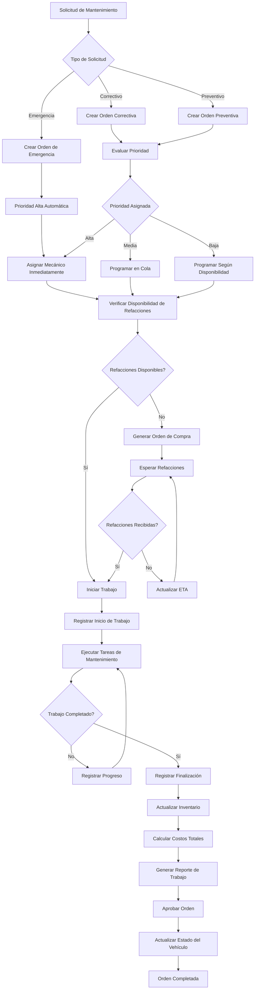

### Estados de Órdenes de Trabajo

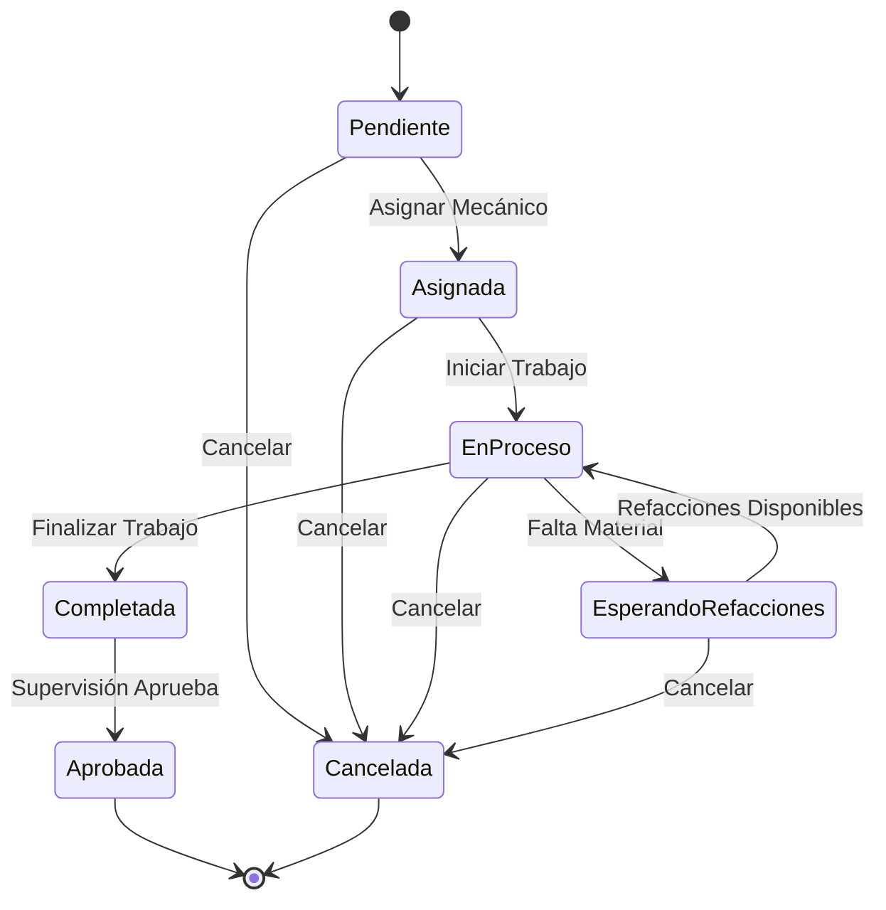

## 2. Flujo de Mantenimiento Preventivo

### Diagrama de Programación Automática

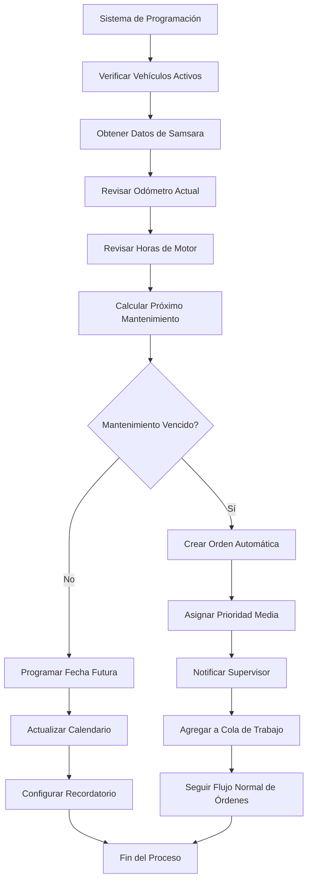

### Tipos de Mantenimiento Preventivo

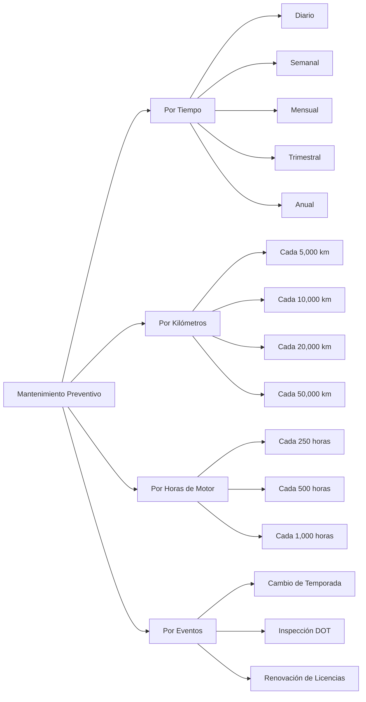

## 3. Flujo de Gestión de Inventario

### Diagrama de Control de Stock

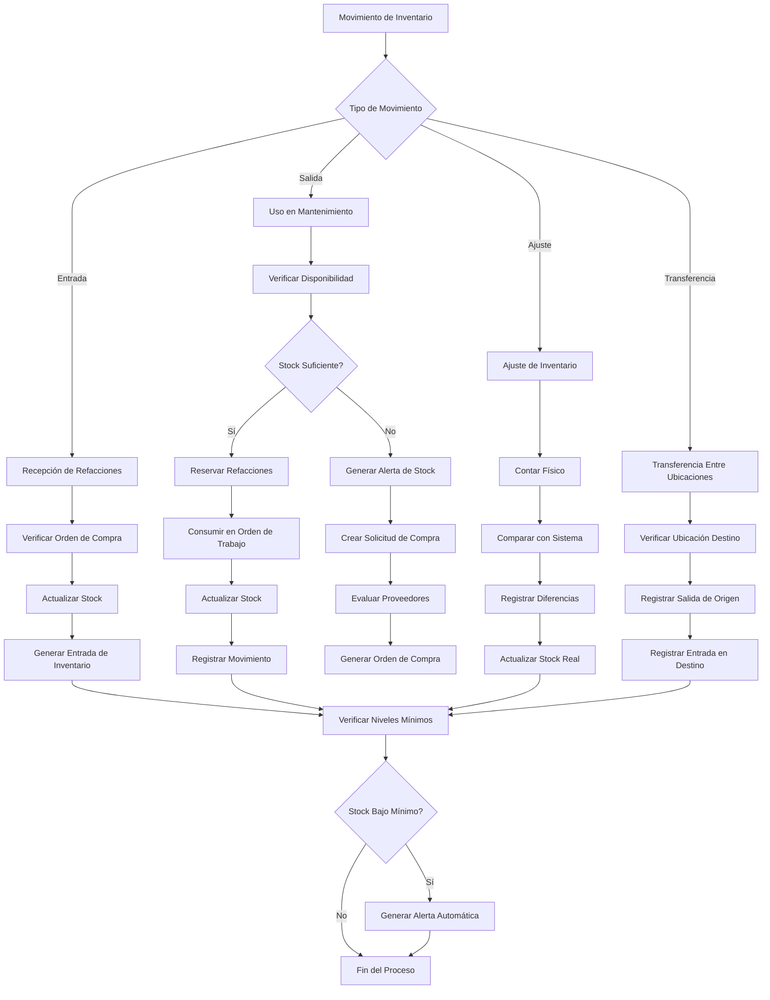

### Flujo de Órdenes de Compra

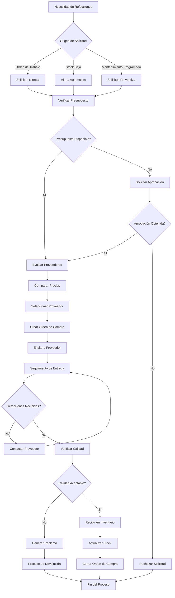

## 4. Flujo de Control de Tiempo y Costos

### Diagrama de Seguimiento de Tiempo

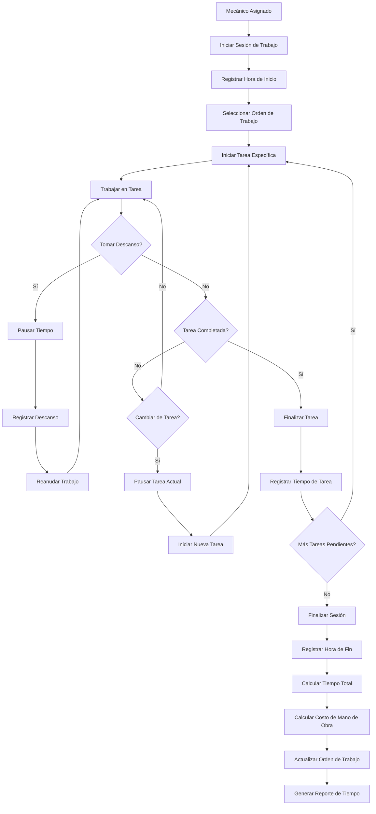

### Cálculo de Costos Totales

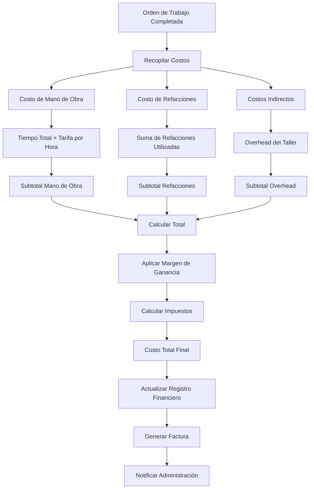

## 5. Flujo de Programación y Calendario

### Diagrama de Asignación de Recursos

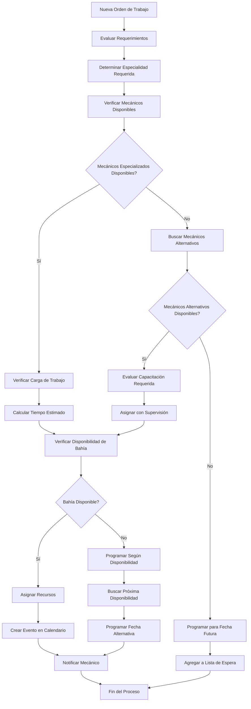

### Optimización de Calendario

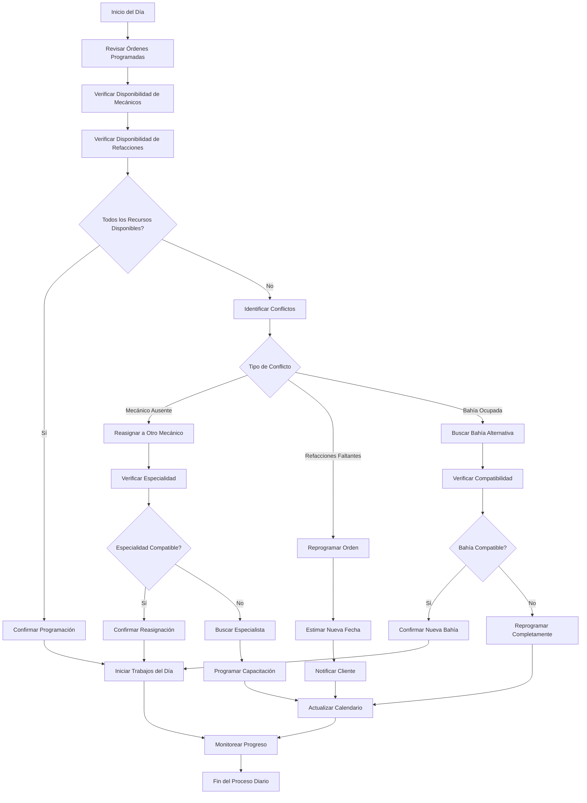

## 6. Flujo de Reportes y Métricas

### Generación de Reportes Automáticos

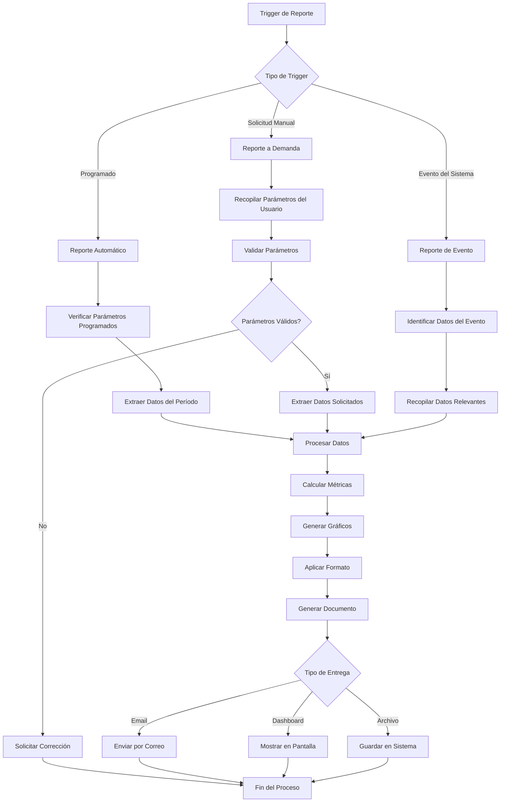

### Métricas de Rendimiento del Taller

```mermaid
graph TD
    A[Métricas del Taller] --> B[Eficiencia Operativa]
    A --> C[Calidad del Servicio]
    A --> D[Costos y Rentabilidad]
    A --> E[Gestión de Recursos]
    
    B --> B1[Tiempo Promedio de Reparación]
    B --> B2[Órdenes Completadas por Día]
    B --> B3[Utilización de Bahías]
    B --> B4[Tiempo de Inactividad]
    
    C --> C1[Retrabajos]
    C --> C2[Satisfacción del Cliente]
    C --> C3[Cumplimiento de Programación]
    C --> C4[Calidad de Reparaciones]
    
    D --> D1[Costo por Hora de Mano de Obra]
    D --> D2[Margen de Ganancia por Orden]
    D --> D3[Rotación de Inventario]
    D --> D4[Costo Total de Mantenimiento]
    
    E --> E1[Productividad por Mecánico]
    E --> E2[Utilización de Herramientas]
    E --> E3[Disponibilidad de Refacciones]
    E --> E4[Capacitación del Personal]
```

## 7. Flujo de Integración con Sistemas Existentes

### Integración con Gestión de Flota

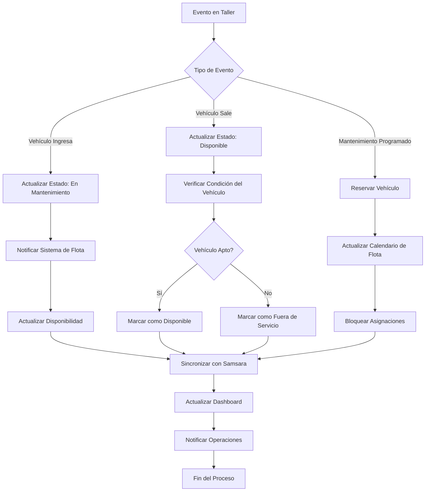

### Integración con Sistema Financiero

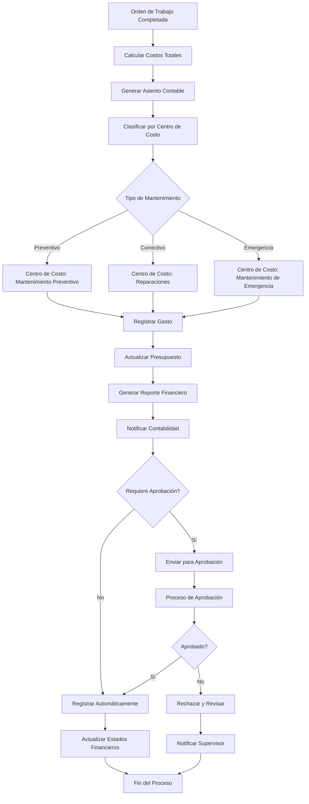

## 8. Flujos de Excepción y Manejo de Errores

### Manejo de Emergencias

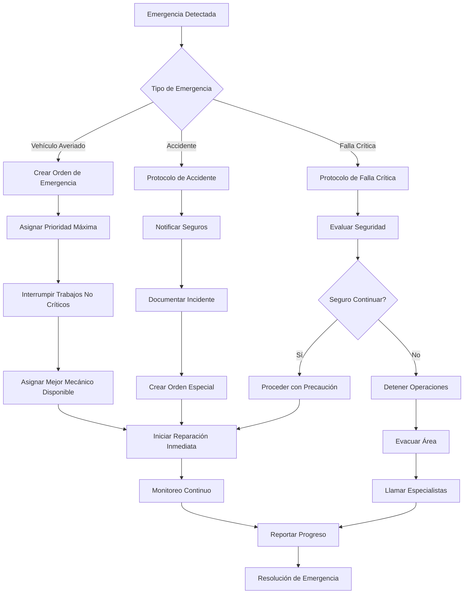

### Recuperación de Fallos del Sistema

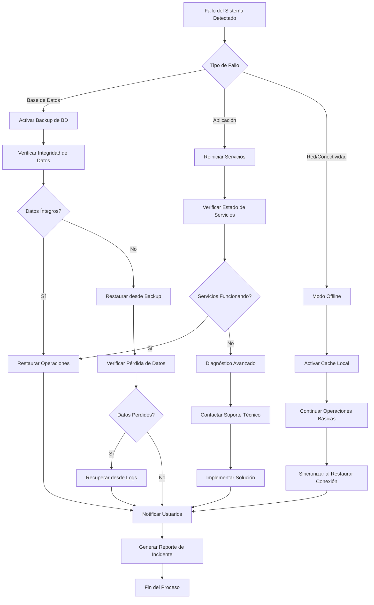

## Consideraciones de Implementación

### Puntos Críticos de Control
1. **Validación de Estados**: Verificar que los cambios de estado sean válidos
2. **Integridad de Datos**: Asegurar consistencia entre módulos
3. **Notificaciones**: Implementar sistema robusto de alertas
4. **Auditoría**: Registrar todos los cambios críticos
5. **Recuperación**: Planes de contingencia para fallos

### Métricas de Rendimiento de Procesos
- Tiempo promedio por tipo de proceso
- Tasa de éxito de cada flujo
- Puntos de embotellamiento identificados
- Eficiencia de recursos por proceso
- Satisfacción del usuario por flujo

### Optimizaciones Futuras
- Automatización de decisiones rutinarias
- Inteligencia artificial para programación óptima
- Integración con IoT para monitoreo en tiempo real
- Análisis predictivo para mantenimiento preventivo